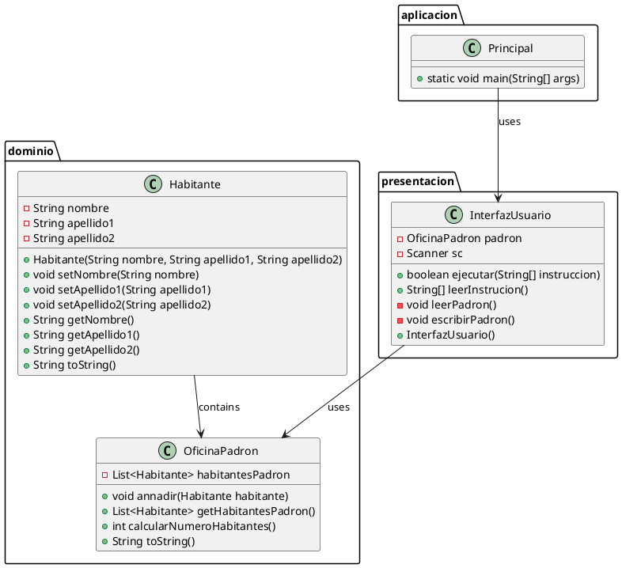

¡Entendido! Aquí tienes el README con un formato más visual y estructurado:

---

# 📊 Diagrama de Paquetes y Clases para Aplicación de Gestión de Padrón

## 📝 Descripción

Este proyecto proporciona un diagrama de paquetes y clases para una aplicación de gestión de padrón de habitantes. La aplicación permite añadir, listar y gestionar habitantes en una oficina del padrón. Es útil para entender la estructura y relaciones entre las clases de la aplicación.

**Autor:** [Tu Nombre]

## 🛠️ Instrucciones de Instalación

1. **Requisitos previos**:
   - Java Development Kit (JDK) instalado.
   - PlantUML instalado o acceso a una herramienta en línea compatible con PlantUML.

2. **Clonar el repositorio**:
   ```bash
   git clone https://github.com/tu-usuario/tu-repositorio.git
   cd tu-repositorio
   ```

3. **Generar el diagrama**:
   - Si usas una herramienta en línea, copia el contenido del archivo `.puml` y pégalo en la herramienta.
   - Si usas PlantUML localmente, ejecuta:
     ```bash
     plantuml diagrama.puml
     ```

## 📚 Ejemplos de Uso

Para generar el diagrama, crea un archivo `diagrama.puml` con el siguiente contenido:



Luego, ejecuta el comando de PlantUML para generar el diagrama.

## 📖 Documentación

Para más detalles sobre cómo funciona cada clase y sus métodos, consulta los comentarios en el código fuente.

## 🗂️ Estructura del Código

- **dominio**: Contiene las clases `Habitante` y `OficinaPadron`.
- **presentacion**: Contiene la clase `InterfazUsuario`.
- **aplicacion**: Contiene la clase `Principal`.

## 🤝 Contribuciones

Las contribuciones son bienvenidas. Puedes contribuir de las siguientes maneras:
- Reportando errores.
- Enviando solicitudes de extracción.
- Proponiendo nuevas características.

## 📜 Licencia

Este proyecto está licenciado bajo Apache 2.0. Consulta el archivo LICENSE para más detalles.

